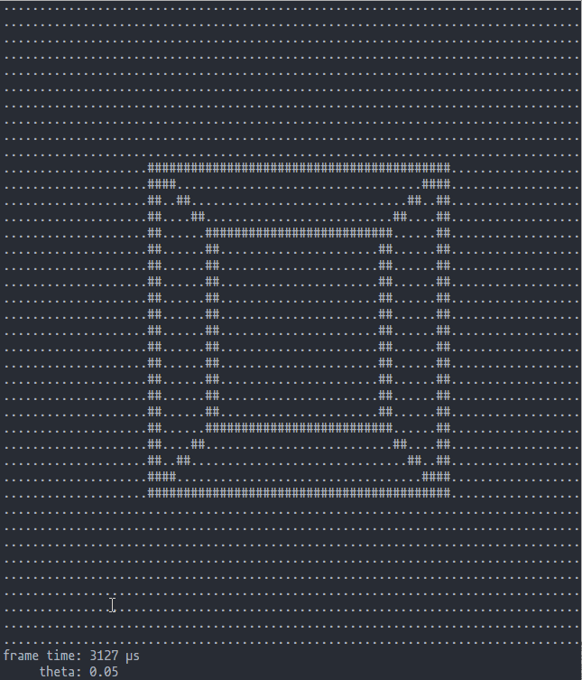
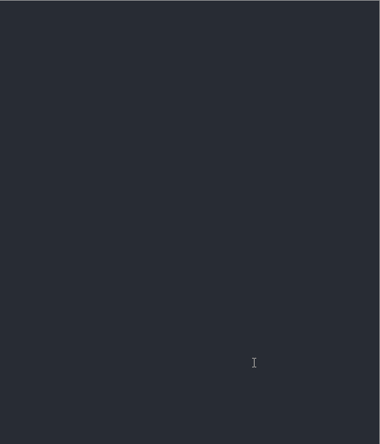
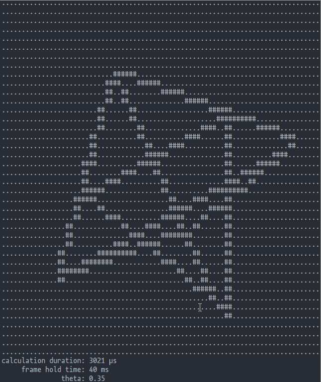
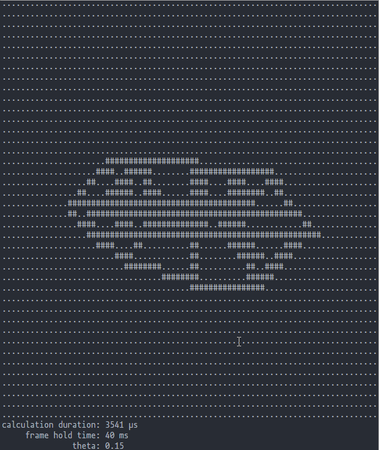
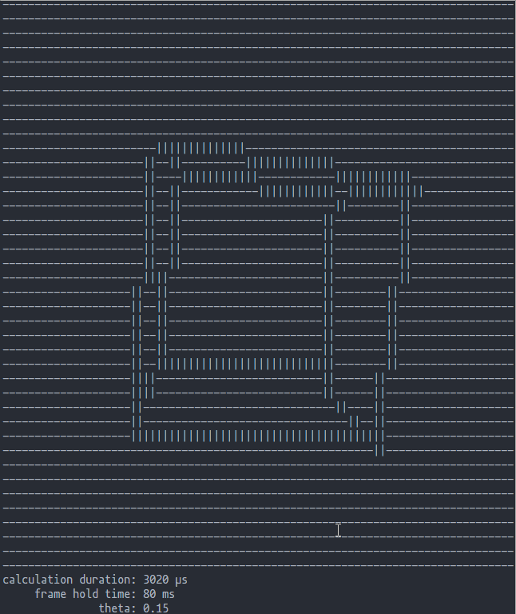

# wireframe-cli
A quick rust implementation of a wireframe renderer for the terminal inspired by [mattbatwings's Minecraft wireframe renderer](https://youtu.be/hFRlnNci3Rs).

Written in Rust because I need to learn more of it. Definitely not optimized as I am not experienced with Rust.

### About the wireframe renderer
This wireframe renderer uses [weak projection](https://en.wikipedia.org/wiki/3D_projection#Weak_perspective_projection) as well as the [digital differential analyzer](https://en.wikipedia.org/wiki/Digital_differential_analyzer_(graphics_algorithm)) to draw the lines. Lots of translation of the Wikipedia page's psuedo- and C++ code.

Rotation is handeled using the shortcut matrix rotation described in [mattbatwings's Minecraft wireframe renderer](https://youtu.be/hFRlnNci3Rs) but with all three rotation able to be used at the same time.

## How to use
### Building
Just use cargo and `cargo build` with `--release` if you want.

### Manual
```
A small wireframe renderer

Usage: wireframe_cli.exe [OPTIONS]

Options:
  -s, --shape <shape>            Pick what shape you want to see (only the ones below)
                                     (cube, pyramid, star_cube, donut) [default: cube]
  -f, --fill <fill>              Pick characters to fill whitespace
                                     (use only one of that character) [default: .]
  -l, --line <line>              Pick characters to use for the lines
                                     (use only one of that character) [default: #]
  -t, --frame-time <frame-time>  Input how long to hold a frame
                                     (in millis) [default: 40]
  -h, --help                     Print help information
  -V, --version                  Print version information
```

# Showcase
## Cube


## Pyramid


## Star Cube


## Donut


## Using Custom Argument Parameters
